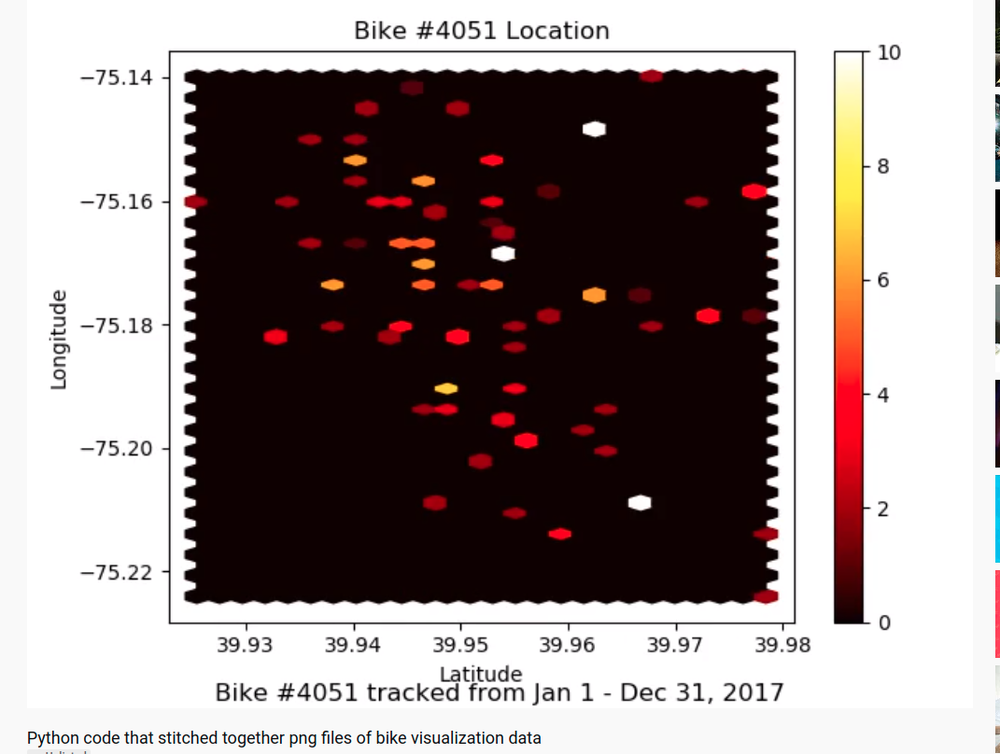
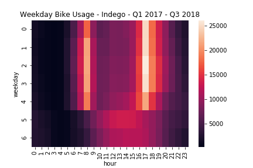
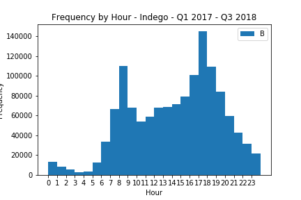

# BikeShare
**Project:**

The BikeShare project explores bike share systems data in the City of Philadelphia using 2017-2018 data. It runs using BASH script from the terminal using Python 3. The script stitches together 12 png files that track the movement of a bike "4051" for 12 months to create a movie. The cleaning, exploring and manipulating of the data was done in Python. Fun project!

 **Dependencies:**

BASH, Numpy, Matplotlib, CVS

**Image:Hexabin Graph of Bike Usage**

that
22
thatthat

**Image:Heatmap Usage**

**Image:Frequency Use by the Hour**

that
22
thatthat
